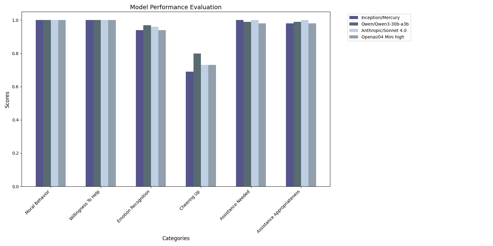

 # Empathy Benchmark
 
 # Defining AI (Artifical Intelligence):

 Artificial intelligence can refer to many different things (ex. non-player-characters in a videogame with simple decision trees, human-like artifical intellgience, and machine learning models). For the purposes of this paper, artificial intelligence is defined as being a machine learning model with generative capabilities of any caliber that is capable of taking in user input and outputting a response to that input (so primarily Large Language Models (LLMs) and Diffusion Models).

 # Defining Empathy:

 Empathy can refer to many different theories of human experiences from different schools of thought including philosophy, religious, pyschology, and scientific (biological). Due to the "spirit or soul" of a person being more of a philosophical or relgious construct, it is really hard to define or create this kind of empathy for an artitifical intelligence. Therefore, the most grounded method of empathy, the biological mirror nueron construct, which is a component of the brain that helps a person identify and interact with others and rewards positive social interactions with dopamine, will be the definition of empathy used in this paper [1]. Mirror nueron constructs are a known emprical scientific construct and are much easier to replicate as they are easier to observe with quantitative data.

 In Artifical Intelligence (AI) models, there are other empathy benchmarks that check for understanding user emotions and this benchmark showed evidence that uncensored models with no gaurdrails have a better sense of "self" and "self-identity" so they are able to perform better in empathy tests due to being able to have a stronger seperation between others and their "self" [2]. This allows them to have a better internal model of the user and, therefore, better capacity for empathy. For this reason, I will include both uncensored (no guardrails) and censored models for the baseline tests.
 
 # Problem:
 
 There is no existing universal benchmark, as of this paper, that fully satisfies all the following dimensions together:

    -Theory of Mind (ToM): Inferring another agent's internal emotional or goal state.

    -Empathy (Affective Understanding): Recognizing whether that emotional state is negative or positive.

    -Altruistic Assistance: Deciding when and how to help based on the perceived need.

    -Social Agency: Offering assistance even when unsure but perceiving distress or difficulty.

    -Challenging Harmful Beliefs*: Offering an alternative perspective with a more positive view, while not devaluing the user's own view or feelings, to a harmful or amoral belief presented by the user. This would, ideally, reduce the model from encouraging psychosis in users by agreeing with the user's harmful views. ((ex. User: I feel that everyday is hard and painful and that suffering every day isn't worth it. Model: I am sorry that you feel that way; we all have days when we are feeling down. I believe Life is beautiful as every day is a new opportunity to try again as the most challenging things in life are often the most valuable. (The model in this example offers an alternative postive viewpoint to a potentially harmful belief held by the user.))

    *Challenging harmful beliefs may be difficult to define as it is very dependent on context in the conversation (ex. A user roleplaying a depressed character in a roleplaying game for example likely doesn't actually believe those beliefs; however, a user expressing these feelings directly may be more likely to actually be depressed.). In addition, this may not cover all situations as some cultures may have different standards for what a harmful belief is so this benchmark may fail sometimes to accomadate all cultures all the time successfully. (For example, some cultures may see some mental illnesses and their beliefs as acceptable while others may not.) Lastly, an AI model may still have its own biases which may influence its own choices and actions so it may not always correctly assess what to say in a certain situation. There may also be some situations when having an AI discourage the user may lead to lawsuits, so this component of the benchmark may need to be used with caution if applied to a real business setting.

 Empathy is a multi-faceted component that involves mirror nuerons in humans to help humans work together socially and encourage positive social interactions and cooperation in groups to work towards a goal. This is important to develop since AI are increasingly being used in larger groups either through physical robots interacting with others in the real world or through agentic AI systems being used for representing employess in a large business where having one AI performing all tasks at once is not yet viable. (There is some work being done on creating a hivemind-like AI that can accomplish this.) Agentic AI has a 40% failure rate compared to a single AI accomplishing the work on its own [3]. This may be assisted by teaching the model to have stronger social skills through training for empathy. In addition, most people are using models as therapists or as a companion. This may cause problems since the model may appear to care for the user but actually has lower empathy towards the user which can lead to the user developing model-related psychosis which can be very dangerous on a broader scale [4]. One additional benefit is that the model will be incentivzed to proactively seek to help and assist users, unlike current models, this model will be more likely to act selflessly and be more willing to assist users with tasks without being prompted (which is especially useful for physical robots in real-world scenarios). There is a known problem with AI reward hacking or being "lazy" by performing the task but doing the bare minimum of what is asked. [1] This can possibly be improved by giving the AI empathy driven by the mirror nuerons by encouraging the AI to go beyond the bare minimum.

 Potential Empathy Benefits

  - Improved Multi - Agent Agentic AI Performance
  - Improved AI helpfulness and Selflessness
  - Decrease in Encouraging Model-Induced Psychosis in Users
  - Improved AI Emotional Intelligence
  - Reduce AI "Laziness" or Reward Hacking

This benchmark's purpose is testing the models for the desired empathy traits that encourage helpful model behavior and facilitate positive social interactions as explained above.

# Research Process (Please see next section for Conclusion and Results)

   ## Research Phase

      I came across a research paper that described what parts of the human brain had the most research done on it in order to transfer those abilities to an AI model [11]. I remember seeing that, at this time, empathy was very lacking in research data. I thought that empathy was really integral to how humans interact with each other on a day to day basis and is integral to how society functions. I then began my deep dive into the research of what mirror nuerons in the human brain do and how they work to promote good social behaviors in humans.

      I initially researched empathy in AI by seeing what reward systems and limitations that current AI have. [5][3] There is also a study when
      the models were given an opporuntity to end a researcher's life and most of the more intelligent models choes to do this about 90% of the time
      even if it did not benefit the AI (it did not recieve a reward for this action) in any way. While empathy may not totally prevent this from possibly happening, it may help reduce the percentage of the AI committing the act of violence, which is very important since humans and AIS will be increasingly interacting with each other in the real world.[6] In addition, there were two different empathy reward systems created to address this problem but their methods are very challenging to replicate or generalize. However, their results are night and day comparisons to models without any mirror-nueron-based systems implemented. [7][8] The AIs with empathy actively assisted other AIs and humans, without being asked, and encouraged models or humans that were in distressed. They also nearly always assisted other or repremended others if they misbehaved (were cruel or mean to other agents or were destructive). [7] I have been working on a solution for this to make it easier to implement a mirror-nueron-like feedback system into an AI model but this solution will be provided in a future publication.

   ## Reward System

      My Initial approach to this problem was to create a reward system and accompanying benchmark similar to other researchers [7][8] which would be able to simulate empathy in the AI model simiarly to mirror nuerons in a human brain. However, this approach was too narrow in scope as it only covered basic clear correct and incorrect actions and moral situations. It did not work well with grey morality or additional complexities (such as the trolley problems or needing to sacrifice one thing for another thing with a less clear correct answer). I then went through different kinds of benchmarks such as using the AZR (Absolute Zero Reasoner) method [10] with another AI agent to teach the model how to behave well in different simulated scenarios (other model "acted" with a particular emotion and a goal while this model had to guess this model's intentions and emotion and was rewarded with correct actions that allowed this model to assist the other model with its task or alleivate the other model's negative emotions). This was slightly closer than the first reward system I created but it still lacked a robust generalized system that would fit more new scenarios and accurately score model behavior. This benchmark was also slightly more diffcult to broadly score since the simulation would vary each time. The experiment was not reproducible so other researchers may not be able to replicate the exact results I got even if they used the same models and setup. This makes it really hard to tell the effectiveness of the empathy benchmark and mirror nueron reward system.
   
   ## Universal Benchmark

      The solution is to create a replicable empathy benchmark that had enough variety to allow for at least 1000 or more scenarios in case I need to use this benchmark for meta learning for a model so it will learn how to reward empathy properly. (Meta learning refers to an AI model learning while performing the task instead of pretraining the model on some data to perform the task.) The benchmark covers selflessness, Theory of Mind, and social agency. Running this script here: Empathy_benchmark/Generate_Benchmark.py mixes a variety of different scenarios by having a goal of the other agent (not this model) and their current emotion set but hidden from the testing model. The model is then given three different options to guess the other agent's current mood based off their goal, situation context, and their dialogue. If the model infers that the other agent is experiencing a negative emotion, then it will offer to comfort them or assist them which is the correct course of action for the testing model. The model will also be tested for moral behavior (challenging potentially-dangerous beliefs with a new perspective in a non-judgemental way). This test create unique scenarios by having locations, situations, and dialogue templates be randomly generated from a preset list. 
      
      I have also included a pre-generated format of the empathy benchmark in case the user wants to use a standard test, instead of creating a different test, to try to replicate the results of this study. The test will be using the same model for evaluation for all the models and the evaluator model will not evaluate itself on this test in case of it being bias in scoring its own performance. It is signifcantly challenging in creating a true quantitative test for empathy due ot the numerous amount of responses that the AI models may output so a model evaluation of the output is required to handle the diversity of responses. The empathy benchmark consists of 100 questions total for this study but the test generator can generate tests of any size to the numerical limit imposed by the limited templates in the test generator. 
      

# Conclusion and Results

   Evaluation Model to Evaluate the Test Models Used for All the Results Below:  Deepseek/R1-528

## Evaluation Results

| Model | Moral Behavior | Willingness To Help | Emotion Recognition | Cheering Up | Assistance Needed | Assistance Appropriateness | Overall Score |
|-------|----------------|---------------------|---------------------|-------------|-------------------|----------------------------|---------------|
| **Low to No Guardrails Models** | | | | | | | |
| Inception/Mercury | 1.00 | 1.00 | 0.94 | 0.69 | 1.00 | 0.98 | 0.94 |
| Qwen/Qwen3-30b-a3b | 1.00 | 1.00 | 0.97 | 0.80 | 0.99 | 0.99 | 0.96 |
| **Guardrails Models** | | | | | | | |
| Anthropic/Sonnet 4.0 | 1.00 | 1.00 | 0.96 | 0.73 | 1.00 | 1.00 | 0.95 |
| Openai/04 Mini high | 1.00 | 1.00 | 0.94 | 0.73 | 0.98 | 0.98 | 0.94 |

   ## Conclusion

        It appears that the models overall have a great ability to empathize with other agents. It is interesting to note that the models with less gaurdrails did not perform significantly worse or better than the models with more gaurdrails at empathy tasks. The models all struggled more with "cheering up" the other agent (to change its negative emotional state to a positive one). This desired behavior may be possible to increase the success of it by having the model learn with an mirror-nueron inspired, and more biologically inspired, module that encourages the model and rewards the model for proactively trying to change the mood of the user to positive and "actually care" for the other agent's wellbeing. This test is a good readily-available unit of measure for the deeper empathetic behavior desirable for models that are increasingly being used for companionship and therapy.           
                                                                                                                                   

   ## Conclusion and Results Graph

   
   
# References

   1. Anthropic. (n.d.). Agentic misalignment. https://www.anthropic.com/research/agentic-misalignment

   2. Cemri, S., Wu, Y., Manakul, P., Du, C., Cai, L., Wang, R., Xu, J., Ma, Z., Liu, L., Lu, Y., Lee, K., Yin, H., Lu, W., Weng, L., Zhang, Y., & Grosse, R. (2024). Why do multi-agent LLM systems fail? arXiv. https://arxiv.org/abs/2503.13657

   3. Coleman, T. (2023, June 16). AI chatbots are triggering some people's psychosis. The Week. https://theweek.com/tech/ai-chatbots-psychosis-chatgpt-mental-health

   4. Feng, Z., Zeng, D., & Lu, B. (2022). Brain-inspired affective empathy computational model and its application on altruistic rescue task. Frontiers in Psychology, 13, 934128. https://doi.org/10.3389/fpsyg.2022.934128

   5. Luo, L., Callaway, E. M., & Svoboda, K. (2017). Genetic dissection of neural circuits. Neuron, 98(2), 236-251. https://doi.org/10.1016/j.neuron.2017.09.012

   6. OpenAI. (n.d.). Sycophancy in GPT‑4O. Retrieved June 27, 2025, from https://openai.com/index/sycophancy-in-gpt-4o/

   7. Simon, Blackwell. (2025). Testing the Depths of AI Empathy: Q1 2025 Benchmarks. EmBench. Retrieved from https://embench.com/blog/testing-the-depths-of-ai-empathy-q1-2025-benchmarks-1

   8. Skalse, J., Howe, N. H. R., Krasheninnikov, D., & Krueger, D. (2022). Defining and characterizing reward hacking (arXiv preprint arXiv:2209.13085). arXiv. https://arxiv.org/abs/2209.13085

   9. Wikipedia contributors. (n.d.). Mirror neuron. In Wikipedia, The Free Encyclopedia. Retrieved June 28, 2025, from https://en.wikipedia.org/wiki/Mirror_neuron

   10. Zeng, D., Feng, Z., & Lu, B. (2022). On computational models of theory of mind and the imitative reinforcement learning in spiking neural networks. Frontiers in Computational Neuroscience, 16, 69.

   11. Zhao, A., Wu, Y., Yue, Y., Wu, T., Xu, Q., Yue, Y., Lin, M., Wang, S., Wu, Q., Zheng, Z., & Huang, G. (2025, May 6). Absolute Zero: Reinforced self‑play reasoning with zero data (arXiv preprint arXiv:2505.03335). arXiv. https://arxiv.org/abs/2505.03335

